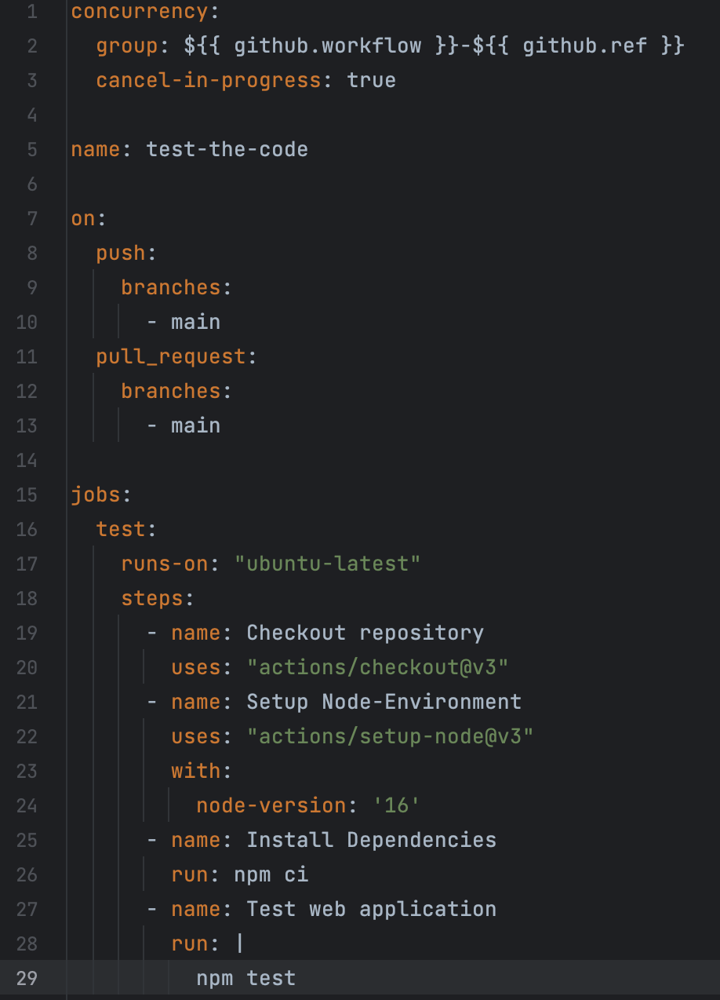
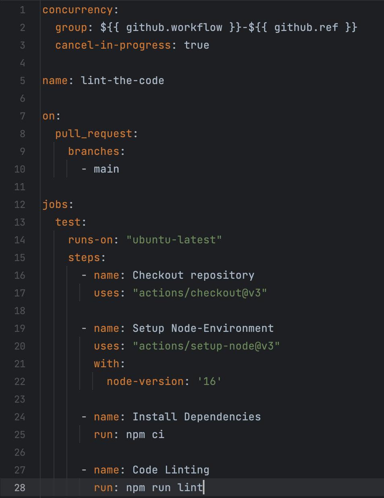
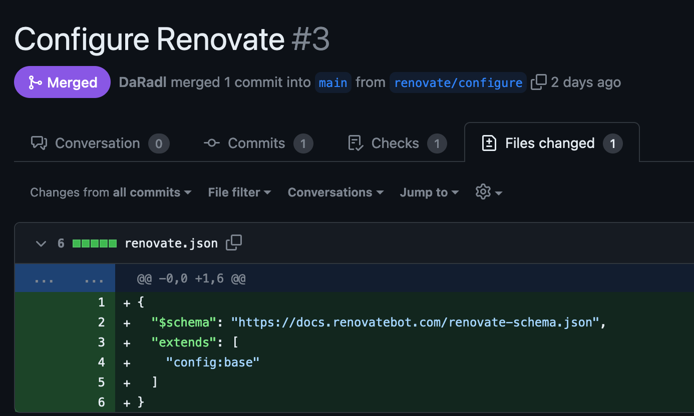
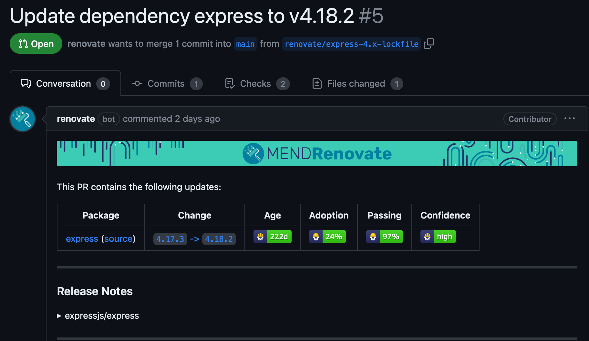
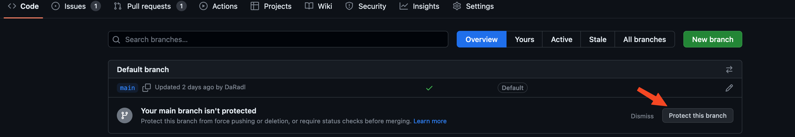
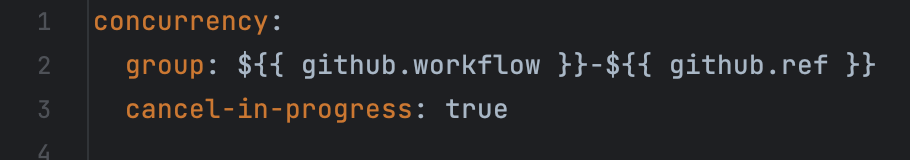

# Dokumentation (High Level)
FH-Burgenland 2023

Umsetzung und Dokumentation (High Level) der Projektumsetzung (Inklusive Zugriff zum Source Code; entweder ein öffentliches Repo oder Einladung ins private Repo)

## Folgende Anforderungen müssen erfüllt werden..
Projekt-Autoren:
**[Sebastian Loidolt](2210781008@fh-burgenland.at), [Dominik Mucha](2210781015@fh-burgenland.at), [Patrick Schlögl](2210781013@fh-burgenland.at), [Daniel Radl](2210781010@fh-burgenland.at)**

All rights -> [HERE](APP_README.md)

### Anlage eines automatischen Builds der bei jedem Pull-Request in den Main läuft und auch bei jedem Push in den Main Branch selbst

Hierfür wurde auf Basis des [Build.yml](https://github.com/DaRadl/FHB-MCCE-2023-Todo-Frontend/blob/main/.github/workflows/ci.yml) aus der Projektübung [FHB-MCCE-2023-Todo-Frontend
](https://github.com/DaRadl/FHB-MCCE-2023-Todo-Frontend) der LV folgendes [ci.yml](./.github/workflows/ci.yml) erstellt.  
Gelöst wurde das durch die Angabe von den GitHub-Actions vodefinierten Funktionen `push` und `pull_request` für den Hauptbranch `main`.

### Anlage von mindestens 3 Unit-Tests
Hierfür wurde auf Wissen der Projektübung [FHB-MCCE-2023-Todo-Frontend](https://github.com/DaRadl/FHB-MCCE-2023-Todo-Frontend) aufgebaut und für 
das bereitgestellt index.js ein index.test.js file für die unit Tests angelegt. Als Unit-Test Framework wurde [Mocha](https://mochajs.org/) eingesetzt. Folgende 3 Unit Tests wurden angelegt:
1. Unit-Test zur Betestung der Methode `generateId()` die direkt der gleichnamigen Konstante zugewiesen ist. 
Da es sich um den Zugriff auf eine **private Konstante** des unveränderten source code handelt, was per default mit Mocha nicht möglich ist, war es notwendig auf [rewire](https://www.npmjs.com/package/rewire) zurückzugreifen.
2. Unit-Test (Rest Api-Test für GET "/") zur Betestung der per express App implementierten Api Methoden. Verwendet wird dafür der Http-Client [request](https://www.npmjs.com/package/request). 
Geprüft wird auf erfolgreiche HTTP Response (200) und den angezeigten Content: Hello World.
3. Unit-Test (Rest Api-Test zur Validierung von GET "api/notes"). Hier haben wir uns dafür entschieden die Response für api notes gegen ein JSON Schema zu validieren was div Vorteile hat. Das Schema wurde mittels [chai-json-schema](https://www.chaijs.com/plugins/chai-json-schema/) gegen das Schema [notes_schema_v1.json](test/resources/notes_schema_v1.json) validiert, dass mittels Schema Generator erstellt wurde.

### Aufnahme der Unit-Tests in den Build für jeden Pull-Request in den Main Branch sowie bei jedem Push in den Main Branch selbst

Gelöst wurde das, indem in der [ci.yml](./.github/workflows/ci.yml) die Schritte für den checkout des aktuellen Source Code stand hinzugefügt. 
Danach erfolgt die Installation der verwendeten Abhängigkeiten mittels `npm ci` und der start der tests mittels test step aufruf `npm test`. 

Anschließend wurde das, indem im customisierte [package.json](./package.json) der build step `"test": "mocha --exit"` hinzugefügt, indem Mocha aufgerufen wird. 
`--exit` war notwendig damit in der pipeline am Ende des Test-Runs der context geschlossen wird und die Pipeline fortläuft.

### Installation und Konfiguration (beliebige Konfiguration von jenen die bei der Installation vorgeschlagen werden) von ESLint für das Projekt

Die Integration ist mittels Installation der von eslint über npm erfolgt. Zusätzlich wurde für die IDE IntelliJ das Plugin für die statische Code Analyse [Sonar Lint](https://plugins.jetbrains.com/plugin/7973-sonarlint) vom JetBrains-Marketplace installiert. ESlint wurde als build step in die [package.json](./package.json) mit source auf den source code in src `"lint": "eslint src/**/*.js"` hinzugefügt. 

### Aufnahme von ESLint in den Build bei jedem Pull-Request in den Main Branch
Es wurde ein neuer github actions workflow [lint.yml](./.github/workflows/lint.yml) anglegt und mit trigger auf `on` `pull_request` in den `main` branch konfiguriert.  

### Konfiguration eines Automatismus zum Update von Fremdkomponenten, wennes eine neue Version gibt (z.B.: snyk, Dependabot, ...)
Für das automatische Updaten von Fremdkomponenten haben wir uns für den RenovateBot entschieden. Dieser wurde per [Install](https://github.com/apps/renovate)-Button in Github explizit für dieses Repository installiert. Nach der Authorisierung der Integration über Github onboarded sich der Bot selbstständig mittels Konfiguration über [Pull-Request 3](https://github.com/DaRadl/FHB-Assignment-Backend/pull/3).  
  
Dabei wird die Konfiguration mittels renovate.json mit einer vordefinierten Basis Konfiguration zum Repository hinzugefügt.
ref.: https://docs.renovatebot.com/getting-started/installing-onboarding/

Nach der Konfiguration mittels Merge schlägt der Renovate sofort vor die Basis-Komponente der Express App mittels neuer express-Version `4.17.3 -> 4.18.2` zu aktualisieren. Dafür wurde automatisch [Pull-Request 5](https://github.com/DaRadl/FHB-Assignment-Backend/pull/5) von Renovate erstellt.  

### Konfiguration von Statischer CodeAnalyse inklusive QualityGate(s).Diese sollen auch bei jedem Pull-Request in den Main Branch ausgeführt werden.
ESLint wurde bereits für jeden Pull-Request in den Main Branch konfiguriert. Zusätzlich wurden als Quality Gate in der [.eslintrc.json](./.eslintrc.json) Config noch Regeln zur Analyse von fehlenden Semicolons und Single statt Double Quotes mittels `warn` hinzugefügt. Siehe Verlauf von [PR-2](https://github.com/DaRadl/FHB-Assignment-Backend/pull/2) und z.B.: [Pipeline-Run hier](https://github.com/DaRadl/FHB-Assignment-Backend/actions/runs/5005533354/jobs/8969624669), sowie die angepasste Konfiguration für amd und die aktuelle es2022. Das Ergebnis der Regeln ist das der geöffnete Pull-Request (2) nach dem Resultat des Pipeline-Run mit dem Ergebnis `x Warning` durch die Conde-Analyse nicht gemerged werden kann aufgrund der konfigurierten Regeln. Die Fehler wurden ausgebessert sodass alle Regeln eingehalten wurden und der PR konnte nach dem erfolgreichen Pipeline-Run gemerged werden.

Damit das Qualitygate verbindlich von allen Contributor eingehalten wird wurde der `main` als `protected` eingestellt sodass nicht mehr direkt in den main branch gepusht werden kann und ein Merge Request mittels Quality-test verbindlich ist.

***Zusatz**
Da die CI Pipeline-Durchlaufzeit nach den DevOps CI/CD Prinzipen möglichst gering gehalten werden soll und technisch vorerst kein Einwand dagegen spricht wurde entschieden die [Test-Pipeline](https://github.com/DaRadl/FHB-Assignment-Backend/actions/workflows/ci.yml) `ci` und die [Lint-Pipeline](https://github.com/DaRadl/FHB-Assignment-Backend/actions/workflows/lint.yml) unabhängig voneinander parallel bereitzustellen. Das war durch die concurrency mittels Gruppierung auf den GitHub Actions Workflow plus Reference möglich.

